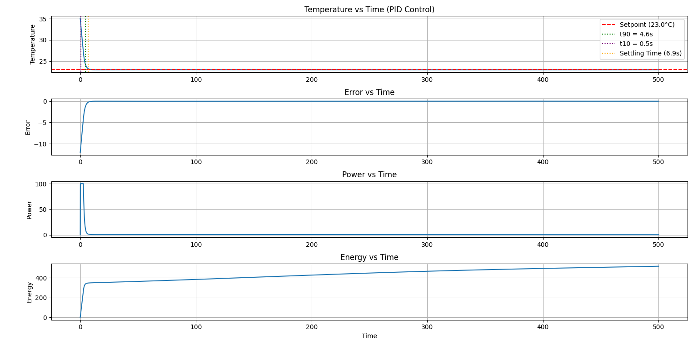

# AC Temperature Control Using PID with Twiddle Auto-Tuning

## Overview

This project simulates an air-conditioning temperature control system using a PID (Proportional–Integral–Derivative) controller. The PID gains are automatically optimized using the Twiddle algorithm to achieve fast temperature regulation while minimizing control effort and energy consumption.

The simulation models a first-order thermal system with varying ambient temperature conditions and evaluates controller performance using standard control engineering metrics.

---

## Features

* PID-based temperature control
* Automatic PID tuning using Twiddle optimization
* First-order thermal system simulation
* Sinusoidal ambient temperature disturbance
* Anti-windup protection for the integral term
* Energy-aware cost function
* Performance metric evaluation:

  * Rise Time (10–90%)
  * Settling Time (±2% band)
  * Overshoot
* Response visualization using Matplotlib

---

## System Model

The thermal dynamics are modeled as:

dT/dt = (Tamb - T)/τ + k·u

where:

* T = Room temperature (°C)
* Tamb = Ambient temperature (°C)
* τ = Thermal time constant
* k = Actuator gain
* u = PID controller output

The ambient temperature varies sinusoidally to simulate environmental disturbances.

---

## Optimization Method

The Twiddle algorithm iteratively adjusts:

* Kp (Proportional Gain)
* Ki (Integral Gain)
* Kd (Derivative Gain)

to minimize the objective function:

Cost = Σ(e²·dt) + 0.2 × Energy

where:

* e = Tracking error
* Energy = Σ(u²·dt)

This balances temperature tracking accuracy and energy consumption.

---

## Optimized PID Gains

| Parameter | Value   |
| --------- | ------- |
| Kp        | 2.655   |
| Ki        | 0.09584 |
| Kd        | 0.56283 |

---

## Performance Results

Setpoint Temperature: **23°C**

| Metric        | Value   |
| ------------- | ------- |
| Rise Time     | 4.10 s  |
| Settling Time | 6.90 s  |
| Overshoot     | 0.084 % |
| Final Cost    | 298.158 |

---

## Simulation Output

The figure below shows the optimized PID controller response for a 23°C setpoint.

### Observations

- Optimized PID gains:
  - Kp = 2.655
  - Ki = 0.09584
  - Kd = 0.56283
- Rise Time: 4.10 s
- Settling Time: 6.90 s
- Overshoot: 0.084 %
- Stable convergence to the setpoint
- Minimal oscillation after settling
- Fast reduction in tracking error
---

## Project Structure

ac_pid_autotuner.py

* Thermal system simulation
* PID controller implementation
* Twiddle auto-tuning algorithm
* Performance metric computation
* Visualization and plotting

---

## Conclusion

The Twiddle-based optimization successfully identified PID parameters that provide fast and stable temperature regulation. The optimized controller achieved a rise time of 4.10 seconds, settling time of 6.90 seconds, and negligible overshoot of 0.084%, demonstrating effective temperature control with minimal oscillation and efficient energy usage.

---

## Technologies Used

* Python
* Matplotlib
* Control Systems (PID)
* Numerical Simulation
* Optimization Algorithms (Twiddle)
